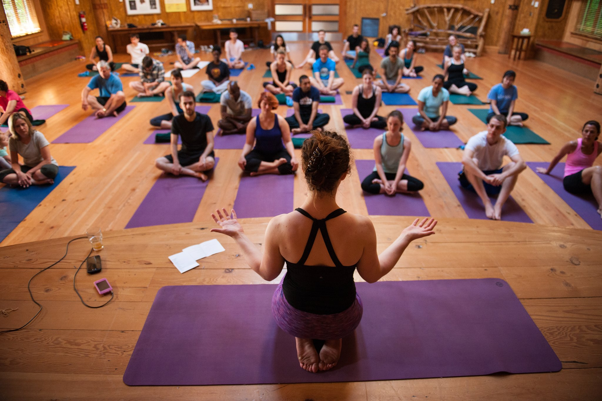
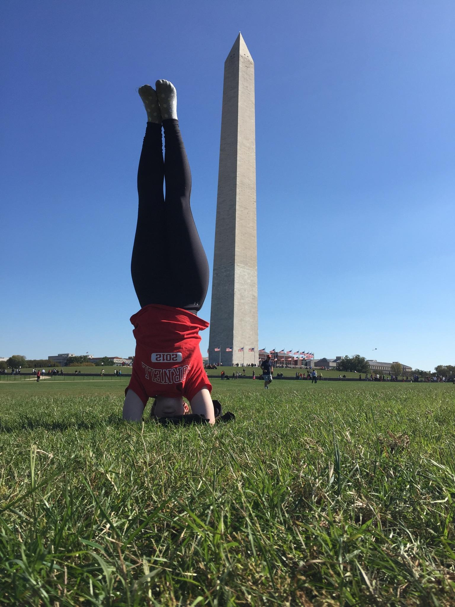

I have been practicing yoga (in one discipline or another) since 2005. After moving to DC in 2012, I was fortunate to find a wonderful community studio, The Studio DC. I, where I began as a student, and then a trainee, earning my RYT-200 hour teaching certifiation, before finally becoming a teacher. 

In addition to teaching in a studio capacity, I also offer private individual and group sessions. Feel free to contact me to learn more!

